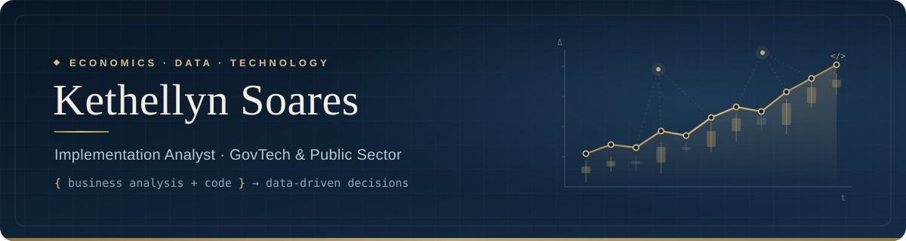

  

  
  
  

---

### Sobre mim

Sou **economista** e analista de projetos na **Facilit Tecnologia**, uma GovTech que desenvolve soluções de gestão estratégica para governos. Atuo no time de **Projetos e Clientes**, conduzindo a implantação da **Plataforma Target** em prefeituras e governos estaduais — do diagnóstico de negócio à entrega técnica.

Cheguei à tecnologia pela economia: entrei como estagiária, sem background técnico, e hoje transito entre os dois mundos. Traduzo a necessidade do gestor público em requisitos, estrutura de dados e, quando preciso, em código.

> *Economia me ensinou a fazer as perguntas certas. Tecnologia me deu as ferramentas para respondê-las.*

### O que eu faço

- **Análise de negócio e implantação** — diagnóstico de clientes, desenho de hierarquias de projetos (EAP) e parametrização da plataforma
- **Desenvolvimento front-end customizado** — portlets em HTML, CSS e JavaScript para ambientes Liferay
- **Automação e integrações** — scripts em Python e JavaScript consumindo APIs REST para migração de dados e rotinas operacionais
- **Requisitos e documentação** — Termos de Levantamento de Requisitos, manuais de ambiente e documentação para clientes
- **Dados e BI** — requisitos de dashboards e indicadores para monitoramento de políticas públicas
- **IA aplicada** — desenvolvimento assistido por IA (Claude, Cursor, Lovable), protótipos de servidores MCP e POCs de IA para o setor público

### Stack

  
  
  
  
  
  
  
  
  
  
  

### Formação

- **Ciências Econômicas** — graduada
- **Administração** — em andamento, FCAP/UPE

### Áreas de interesse

`GovTech` · `Gestão pública orientada a dados` · `Economia aplicada` · `Automação de processos` · `IA no setor público` · `Implementation & Solutions Consulting`

---

<b>English version</b>

 

I'm an **economist** and **Implementation Analyst** at **Facilit Tecnologia**, a Brazilian GovTech. I lead implementations of the **Target platform** — a strategic management and monitoring solution — for municipal and state governments, from business discovery to technical delivery.

I came to tech through economics: I joined as an intern with no technical background and now work as a hybrid analyst-developer, turning public managers' needs into requirements, data structures and, when needed, code.

**What I do:** business analysis & software implementation · custom front-end portlets (HTML/CSS/JS on Liferay) · Python and JavaScript automation over REST APIs · requirements and client documentation · BI/dashboard requirements · AI-assisted development and AI prototypes (MCP servers, AI POCs).

**Education:** B.Sc. in Economics · Business Administration (in progress, FCAP/UPE).

**Open to:** remote opportunities in implementation, solutions consulting and AI implementation.

